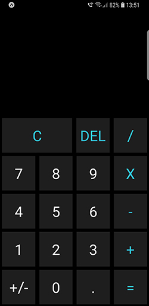
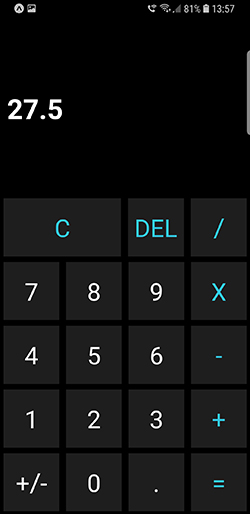

# Mobile-calc-reactNative

Basic calculator application for mobile devices.

# Purpose

The purpose of this application was to practice new skills in react-native environment:
 * creating new application,
 * developing the application,
 * starting server with application, connecting to phone, hot-loading,
 * debugging.
 
# description

Application can do simple calculations on decimal numbers. It look is shown on screens below:

  

User can input numbers with defined keyboard. Numbers can have decimals - by typing dot symbol. numbers can be
separated by mathematics operations: +, -, /, X. User can change the sign of the first number by 
pressing the +/- button. Input data can be cleared (C), last symbol can be deleted also (DEL).
To calculate the equation user has to press button with symbol =. The result will appear instead of
the calculated equation - user can do more calculations with it.

## Implementation

Combinations of numbers and operations are contained in a simple string - which is constantly validated. User can't input
operation or dot first, it's not possible to put two dot symbols in one number. To resolve the equation,
calculation string needs to be completed. There is also maximum length of calculation string set - up to 45 symbols.

When user presses the '=' button and the string is correct, calculation process begins. It includes correct order of
mathematics operations:
*   first application searches for all 'X' signs in calculation string - if it finds it, number on the left
and on the right of the X symbol is taken and multiplied by itself (combinaion of JS regular expressions and string slicing).
In next step result replaces those two numbers separated by 'X' sign (the symbol before number is taken into calculation - it can be negative).
When there are no more X symbols in string, application is moving to the next step.
*   next step is exactly the same as the first, but instead of searching for 'X' signs, application looks 
for '/' symbols - after finding it and numbers on the left and right are divided.
*   third step searches for '+' operations and adds numbers,
*   last step searches for - operations and subtracts numbers. The minus sign at the beggining of the string is
omitted - if it exists, it's only the sign of first number.

# Running the application

Application is not yet deployed, you can run it by two ways: 
*   the best way is to use link snack.expo - you can run application by [clicking here](https://snack.expo.io/@biigm/calc-mobile),
*   the other way is to clone this project to the personal computer, run development server by opening
bash console in application folder and use command "npm start" - after that it's necessary to install 
Expo app on mobile device - it can scan QR code generated in bash console and run developed application.